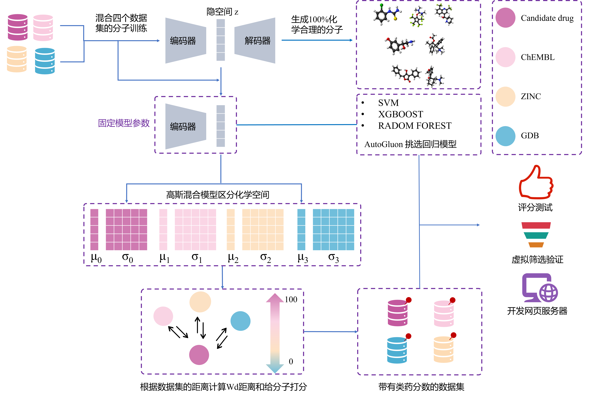

## ChemAIrank: 基于化学空间距离的定量类药性评估模型

## 简介

ChemAIrank 是一种基于化学空间距离的定量类药性评估模型，用于评估和筛选具有潜在药用价值的化合物。通过综合运用化学空间距离、自动机器学习和集成学习的方法，ChemAIrank 在评估类药性方面具有显著优势，且在实际应用中显示出较强的鲁棒性和稳定性。
## 项目结构

本项目包含以下三个文件夹：

1. **ChemAIrank train and test**：包含用于训练和测试 ChemAIrank 模型的数据和代码。
2. **High throughput virtual screening for 7kjs targets**：包含针对 7kjs 靶点的高通量虚拟筛选实验数据和代码。
3. **Build ChemAIrank web server**：包含构建 ChemAIrank Web 服务器的代码和相关文件。

## 主要特点

1. 实现类药性的定量评估，便捷地比较不同分子类药性的高低。
2. 利用变分自编码器（VAE）学习不同数据集的分布特征，采用混合高斯模型对具有显著类药性差异的数据集进行区分。
3. 通过计算化学空间间的距离，为原本没有类药标签的数据集打上类药分数。
4. 引入自动机器学习和集成学习的思想，获得性能最佳的类药评分模型。
5. 在多个任务和数据集上取得了优异的性能，为药物研发提供了宝贵的参考信息。
6. 开发成易于使用的 Web 服务器，方便非计算背景的药物化学家使用。

## 成果与应用

1. 在三个区分药物与非药物的任务上，ChemAIrank 均取得了最高的 AUROC（0.83, 0.94, 1.00）。
2. 在外部数据集上，模型实现了对9个分子性质预测数据集类药性的准确评估。
3. ChemAIrank 评分与药物的 ADME 属性、药代动力学、毒性和分子描述符等方面均存在显著关联。
4. 在针对 CDK2 靶点进行的虚拟筛选中，通过 ChemAIrank 与分子对接、CDK2 激酶抑制剂预测模型等开源工具的联合应用，筛选出10个具有潜力的CDK2 激酶抑制剂。

## 安装依赖包。

* RDKit (version >= 2019)    
* Python (version >= 3.8)      
* PyTorch (version >= 1.8)   
* autogluon(version >= 0.6.2)
* streamlit(version >= 1.14.0)

## 使用说明
### ChemAIrank train and test
安装依赖包。
下载预训练模型。
使用 ChemAIrank 评估输入分子的类药性。
### High throughput virtual screening for 7kjs targets
准备靶点结构和化合物库。
运行虚拟筛选流程，包括分子对接、评分和筛选。
分析筛选结果，识别具有潜力的化合物。
### Build ChemAIrank web server
安装 Web 服务器依赖包。
配置服务器设置。
部署并启动 Web 服务器。

## 数据与模型

由于数据和模型体积较大，我们将它们存储在网盘上。请点击以下链接进行下载：

链接：https://pan.baidu.com/s/1W-vpNIwBvlOWNXJ2A6bXaA?pwd=iuhv 提取码：iuhv
